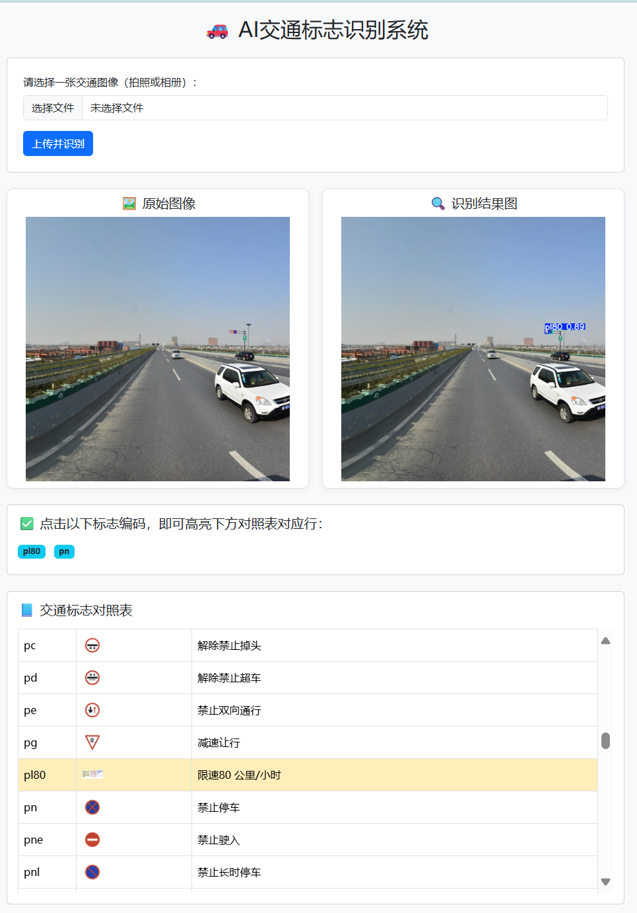
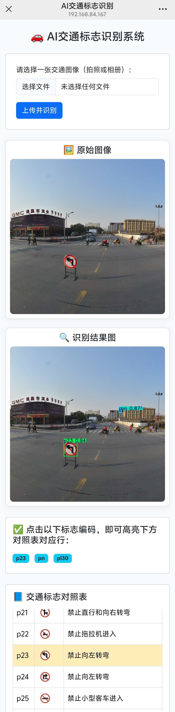

# 小目标交通标志智能检测与识别系统 🚦🧠  
> **Tiny Traffic Sign Intelligent Detection and Recognition System**  
> 基于 YOLOv12 + Django 的轻量级交通标志识别平台  

---

## 📌 项目简介

本系统基于 **YOLOv12** 深度目标检测模型，结合 **TT100K 交通标志数据集**，实现对 **交通场景中小目标交通标志** 的高效检测与识别，并通过 **Django 框架**构建后端服务，提供图像上传、检测与结果展示的完整流程。

可部署于本地或移动端，适用于智能交通、辅助驾驶等场景。

---

## 🧠 技术栈

| 模块 | 技术 |
|------|------|
| 模型训练 | YOLOv12（Ultralytics） |
| 数据集 | TT100K |
| 部署框架 | Django |
| 前端 | HTML + Bootstrap（默认模板） |
| 图像处理 | OpenCV + Pillow |
| 推理设备 | GPU / CPU 均可运行 |

---

## 📁 项目结构
TRAFFIC_SIGN_APP/
├── detector/ # 前端页面与视图逻辑
│ ├── static/icons/ # 图标和图例
│ ├── templates/detector/ # index.html 页面
│ └── views.py # 上传与识别逻辑
├── model/ # 模型与训练脚本
│ ├── exp_TT100K2/ # 训练好的YOLOv12模型
│ ├── detect.py # 检测脚本
│ └── train.py # 训练脚本
│ └── data.yaml # YOLO数据配置
├── traffic_sign_app/ # Django 配置模块
│ └── settings.py / urls.py
├── media/uploads/ # 上传图片保存目录
├── manage.py
└── README.md

python manage.py runserver //网页端启动服务
python manage.py runserver 0.0.0.0:8000 //移动端启动服务，须连接同一局域网

0.0.0.0:8000 表示监听所有网卡的 8000 端口，方便局域网手机访问。
如果仅想本机测试，可执行 python manage.py runserver（默认监听 127.0.0.1:8000）

---

## 🚀 使用说明

### 1. 安装依赖

使用国内源加速安装：

```bash
pip install -i https://pypi.tuna.tsinghua.edu.cn/simple -r requirements.txt
```

### 2. 数据准备

下载并解压 TT100K 数据集，将其放置于 `model` 目录下。

### 3. 模型训练

```bash
cd model
python train.py
```

### 4. 启动服务

```bash
cd ..
python manage.py runserver
```

### 5. 访问页面

在浏览器中访问 `http://127.0.0.1:8000/`，即可使用系统进行图像上传和交通标志检测。
---

## 📦 项目克隆

```bash
git clone <your-repo-url> yolo_django_full
cd yolo_django_full

---

📊 模型表现（YOLOv12 + TT100K）
指标	         值
mAP@0.5	        0.87+
mAP@0.5:0.95	0.68+
适配目标	    小尺寸交通标志（如限速牌、禁止标识等）

📸 示例截图



🏁 项目特色
✅ 支持中文标志名展示
✅ 针对小目标交通标志优化训练
✅ 本地/移动端均可部署

🔗 项目名称释义
“小目标交通标志智能检测与识别系统”：面向真实道路场景，专注小尺寸标志检测，具备轻量、实用、可部署等特点。

📮 联系作者
👤 作者：方泽铠
📧 邮箱：fangzekai117@gmail.com
📌 说明：本项目用于教学、科研或智能交通产品原型开发